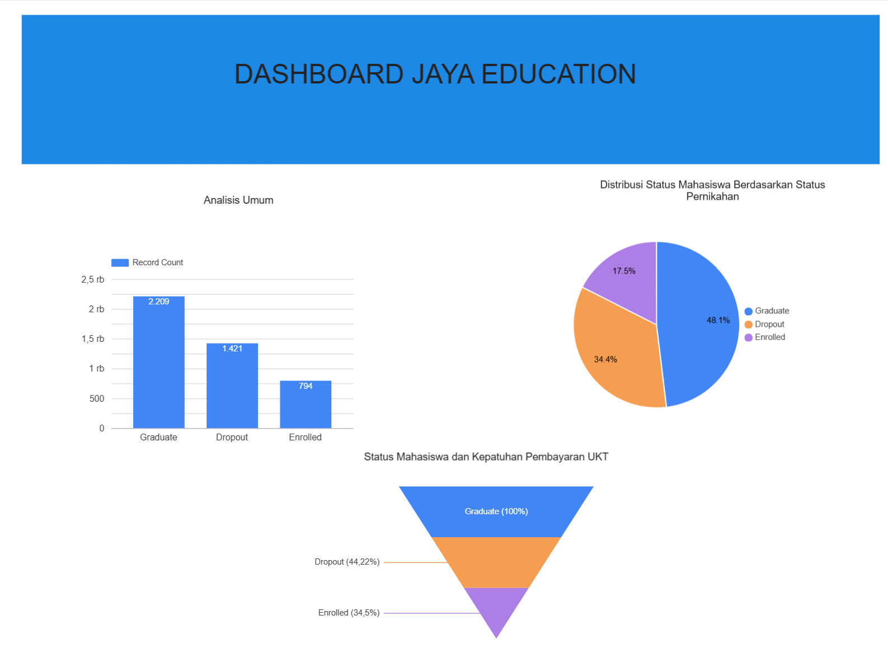

# Proyek Akhir: Menyelesaikan Permasalahan Perusahaan Edutech
## Deskripsi Proyek
Proyek ini bertujuan untuk membantu perusahaan Edutech dalam memprediksi status mahasiswa (Dropout, Enrolled, Graduate) berdasarkan data akademik dan demografis. Dengan menggunakan model machine learning, perusahaan dapat mengidentifikasi mahasiswa yang berisiko dropout dan memberikan intervensi dini untuk meningkatkan tingkat kelulusan.
Business Understanding
## Latar Belakang Bisnis
Perusahaan Edutech menghadapi tantangan dalam meningkatkan tingkat kelulusan mahasiswa. Dengan memanfaatkan data historis mahasiswa, perusahaan ingin memahami pola yang memengaruhi status mahasiswa dan mengambil langkah-langkah strategis untuk mengurangi tingkat dropout.

## Permasalahan Bisnis
* Bagaimana cara memprediksi status mahasiswa secara akurat?
* Faktor apa saja yang memengaruhi status mahasiswa?
* Bagaimana perusahaan dapat mengurangi tingkat dropout mahasiswa?
## Cakupan Proyek
* Mengolah data mahasiswa untuk memahami pola dan distribusi data.
* Melatih model machine learning untuk memprediksi status mahasiswa.
* Mengevaluasi performa model dan memberikan rekomendasi untuk meningkatkan tingkat kelulusan.
## Persiapan
## Sumber Data
Dataset yang digunakan berasal dari file data.csv, yang berisi informasi akademik dan demografis mahasiswa.

## Setup Environment
Python Version: 3.9 atau lebih baru.
Library yang Digunakan:
pandas
numpy
scikit-learn
matplotlib
seaborn
streamlit
joblib
Cara Menginstal Dependensi
Jalankan perintah berikut untuk menginstal semua dependensi:
`` pip install -r requirements.txt ``
##  Business Dashboard

Dashboard telah di-deploy,  link di sini:
https://lookerstudio.google.com/reporting/12177a94-2abf-4168-8b1b-2dfd5acdb015
Dashboard Prediksi Mahasiswa 




## Menjalankan Sistem Machine Learning
## Cara Menjalankan Prototype
* Pastikan semua dependensi telah diinstal menggunakan requirements.txt:
``` pip install -r requirements.txt ```
* Jalankan aplikasi Streamlit:
``` streamlit run streamlit_app.py ```
* Masukkan data mahasiswa pada form yang tersedia untuk mendapatkan prediksi status.
* Link Prototype Akses ke  Solusi Machine Learning yang Siap Digunakan
https://app-dicoding-jaya-educationgit-datascience.streamlit.app/ 

Hasil dan Evaluasi
* Akurasi Model: Model machine learning berhasil dilatih dengan akurasi 76.72% pada data uji.
* Faktor Penting:
Nilai semester 1 dan 2.
Jumlah mata kuliah yang lulus.
Pembayaran uang kuliah tepat waktu.
* Visualisasi:
Distribusi data dan fitur penting divisualisasikan menggunakan matplotlib dan seaborn.
## Kesimpulan
* Bagaimana cara memprediksi status mahasiswa secara akurat?<br>
Jawaban: Dengan menggunakan model machine learning berbasis student_status_model.pkl, akurasi prediksi mencapai 76.72%.
* Faktor apa saja yang memengaruhi status mahasiswa?<br>
Jawaban: Faktor utama adalah nilai semester 1 dan 2, jumlah mata kuliah yang lulus, dan pembayaran uang kuliah tepat waktu.
* Bagaimana perusahaan dapat mengurangi tingkat dropout mahasiswa?<br>
Jawaban: Dengan memberikan intervensi dini berdasarkan hasil prediksi model.
## Rekomendasi Action Items
* Meningkatkan Kualitas Data

Pastikan data yang dikumpulkan lengkap dan akurat, terutama data akademik dan demografis mahasiswa.
* Intervensi Dini

Gunakan hasil prediksi untuk mengidentifikasi mahasiswa yang berisiko dropout dan berikan intervensi dini, seperti konseling atau bantuan akademik.
* Pengembangan Dashboard

Tambahkan fitur analitik lanjutan pada dashboard untuk membantu manajemen dalam pengambilan keputusan.
* Evaluasi Model Secara Berkala

Lakukan evaluasi dan retraining model secara berkala untuk memastikan performa tetap optimal dengan data terbaru.
